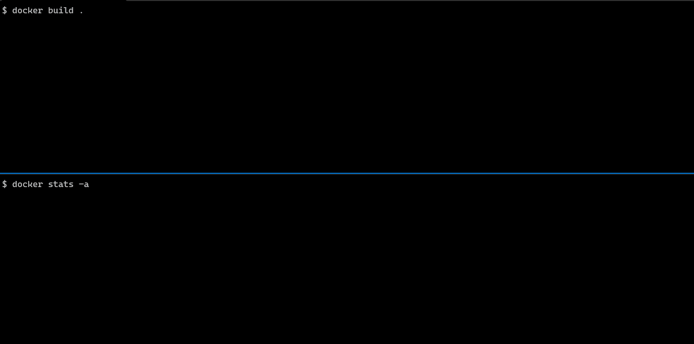
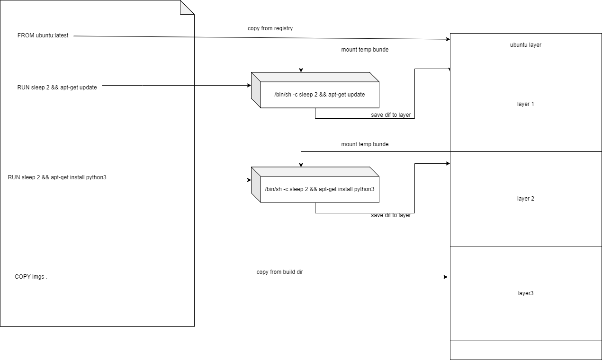
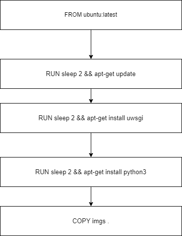
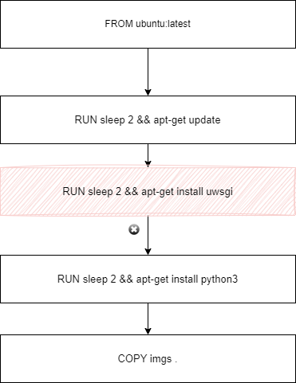
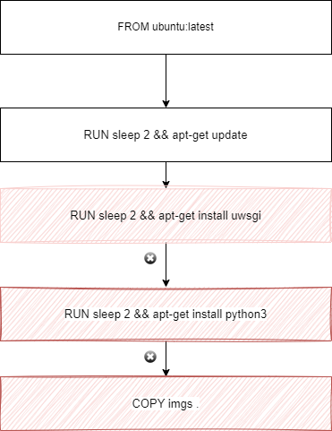

## Virtual Machine vs Containers

A **Virtual Machine** emulates an **entire operating system**, including the kernel, on top of a hypervisor (e.g., VMware, VirtualBox, Hyper-V). Each VM has its own virtual CPU, memory, and disk, which makes it resource-heavy.

Example: Running a full Ubuntu OS inside Windows using VirtualBox.

A **container** is a **lightweight, process-level** virtualization method.
Instead of emulating hardware, **containers share the host OS kernel** but have their own isolated runtime, filesystem, and dependencies.

Example: Running a Python app in a container with only Python installed, while another container runs Node.js, both using the same Linux kernel.

### Are All Containers Docker?
No, not all containers are Docker containers. Docker is just one implementation of containerization. There are other container runtimes, such as:
* **Docker** – The most popular container runtime.
* **containerd** – A lightweight container runtime (used by Docker under the hood).
* **Podman** – A daemonless alternative to Docker.
* **CRI-O** – A container runtime optimized for Kubernetes.
* **LXC (Linux Containers)** – More similar to lightweight VMs than Docker.

### Difference Between Virtual Machines (VMs) and Containers
| Feature| Virtual Machines (VMs) | Containers |
|---|---|---|
| Isolation| Full OS-level isolation| Process-level isolation | 
| OS Requirement | Each VM runs its own OS| Shares the host OS kernel |
| Performance | More resource-intensive (runs full OS) | Lightweight, faster startup |
| Storage	| Large disk footprint (includes OS) | Small size (only includes app dependencies) |
| Boot Time	| Minutes (OS boots fully)	|Seconds (just process startup)|
| Security | Strong isolation (separate OS) | Weaker isolation (shared kernel) |
| Use Case| Running multiple OSes, **strong security** | Microservices, scalable apps |

## How docker runs on Windows?
Docker runs on Windows by **leveraging a virtualized Linux environment**. Since Docker relies on Linux kernel features like cgroups and namespaces, it cannot run natively on Windows without some form of Linux emulation or virtualization. Here’s how it works:

1. Windows Subsystem for Linux 2 (WSL 2) (Default)
    * **Docker Desktop on Windows uses WSL 2**, which is a lightweight Linux VM running inside Windows.
    * WSL 2 provides a real Linux kernel inside a virtual machine (VM), allowing Docker containers to run natively on Linux within Windows.
    * Performance is better compared to traditional VMs since WSL 2 integrates tightly with Windows.
2. Hyper-V (Older Method)
    * Before WSL 2, Docker used Hyper-V, which is Windows' built-in hypervisor to create a small Linux VM that runs Docker Engine.
    * Hyper-V provides an isolated Linux kernel for container execution.
    * The downside is that Hyper-V is only available on Windows Pro, Enterprise, and Education (not Home editions).
3. VirtualBox + Docker Toolbox (Legacy)
    * Before WSL 2 and Hyper-V, users could run Docker using Docker Toolbox, which relied on VirtualBox to run a Linux VM.
    * This method is now deprecated in favor of WSL 2.
4. Windows Containers (Alternative)
    * Windows has native Windows containers that can run directly on Windows using the Windows kernel.
    * However, these containers are different from Linux containers and require Windows Server Core or Nano Server images.

### Summary
* Linux containers on Windows → WSL 2 (default) or Hyper-V (older)
* Windows containers → Run natively on Windows kernel

## What is a Docker image?

Simply put, a Docker image is a file used to execute code in a Docker container.  
* Docker images act as a set of instructions to build a Docker container, like a template. Docker images also act as the starting point when using Docker. 
An image is comparable to a snapshot in virtual machine (VM) environments.
* A Docker image also contains application code, libraries, tools, dependencies and other files needed to make an application run.
When a user runs an image, it can become one or many instances of a container.
* Docker images have multiple layers, each one originates from the previous layer but is different from it. The layers speed up Docker builds while increasing reusability and decreasing disk use. Image layers are also read-only files. Once a container is created, a writable layer is added on top of the unchangeable images, allowing a user to make changes.

### Docker container vs. Docker image
A Docker container is a virtualized runtime environment used in application development. It is used to create, run and deploy applications that are isolated from the underlying hardware. A Docker container can use one machine, share its kernel and virtualize the OS to run more isolated processes.
As a result, Docker containers are lightweight.


A Docker image is like a snapshot in other types of VM environments. It is a record of a Docker container at a specific point in time. Docker images are also immutable. While they can't be changed, they can be duplicated, shared or deleted. The feature is useful for testing new software or configurations because whatever happens, the image remains unchanged.

Containers need a runnable image to exist. Containers are dependent on images, because they are used to construct runtime environments and are needed to run an application.

## Docker Container

#### Difference between a kernel, an operating system, and a distribution.
* **Linux kernel** is the core part of the Linux operating system. It's what originally Linus wrote.
* **Linux OS** is a combination of the kernel and a user-land (libraries, GNU utilities, config files, etc).
* **Linux distribution** is a particular version of the Linux operating system like Debian or CentOS.

#### Does a Container have an Operating System inside?

NO, a container is actually just a process running on the **Linux host**.   
The container process is isolated ([namespaces](https://docs.docker.com/engine/security/#kernel-namespaces)) from the rest of the system and restricted from both the resource consumption ([cgroups](https://docs.docker.com/engine/security/#control-groups)) and security ([capabilities](https://man7.org/linux/man-pages/man7/capabilities.7.html), [AppArmor](https://docs.docker.com/engine/security/apparmor/), [Seccomp](https://docs.docker.com/engine/security/seccomp/)) standpoints.   
But in the end, this is still a regular process, same as any other process on the host system.

- **Namespaces** → These act like invisible walls around the container, so it thinks it has its own environment (such as its own files, network, and processes), even though it shares the same OS as the host.
- **cgroups (Control Groups)** → These limit how much CPU, memory, and other resources the container can use, preventing it from slowing down the whole system.
- **Capabilities & Security** → Containers don’t get full system access by default, which helps keep them secure.

## How docker container images are created

Let's understand the process by building a simple image using Dockerfile
```text
FROM ubuntu:latest

RUN sleep 2 && apt-get update
RUN sleep 2 && apt-get install -y uwsgi
RUN sleep 2 && apt-get install -y python3

COPY imgs .
```

Before we build this image, lets open a new terminal and run docker stats -a



As we see above docker is launching containers while building the images, one for each RUN command

~

Each RUN instruction, is executed in a temporary container launched from the previous image, instructions are executed in this temporary container, and an image layer is generated and added on top of the exisiting image

#### How does the build cache work?

Each instruction in this Dockerfile translates (roughly) to a layer in your final image. You can think of image layers as a stack, with each layer adding more content on top of the layers that came before it.



Whenever a layer changes, that layer will need to be re-built. For example, suppose you remove the instructions to "install uwsgi".



Docker will invalidate the cache for this layer, as well the subsequent layers



And that’s the Docker build cache in a nutshell. Once a layer changes, then all downstream layers need to be rebuilt as well. Even if they wouldn’t build anything differently, they still need to re-run.

## How to modify a Docker image

Interestingly, we can also "commit" changes to a Docker image. When you commit changes, you essentially create a new image with an additional layer that modifies the base image layer.  
Lets see how

1. Either pull a docker image, or reuse existing image, we first list the images
```text
$ docker images
REPOSITORY   TAG       IMAGE ID       CREATED             SIZE
ubuntu       latest    08d22c0ceb15   6 weeks ago         77.8MB
```

2. Then we launch a container with this image
```text
docker run -it 08d22c0ceb15 bin/bash
```

3. Now we are inside this container and we can modify this container
```text
root@7eff45c7c05a:/# apt update && apt install nmap
....
root@7eff45c7c05a:/# exit

```

4. After exiting we need to list the launched containers
```text
$ docker ps -a
CONTAINER ID   IMAGE          COMMAND      CREATED              STATUS                      PORTS     NAMES
7eff45c7c05a   08d22c0ceb15   "bin/bash"   About a minute ago   Exited (0) 17 seconds ago             romantic_cori
```

5. Finally, we can create a new image from this container
```text
docker commit 7eff45c7c05a ubuntu-with-nmap
```

The newly created image will now be visible in
```text
$ docker images
REPOSITORY         TAG       IMAGE ID       CREATED              SIZE
ubuntu-with-nmap   latest    04feaa0bbcf9   About a minute ago   150MB
ubuntu             latest    08d22c0ceb15   6 weeks ago          77.8MB
```

### Copy files to/from running container
Bonus Tip:
```text
$ docker cp ./some_file $CONTAINER_ID:/work
$ docker cp $CONTAINER_ID:/var/logs/ /tmp/app_logs

```

## How to build image without Dockerfile

Dockerfile is not the only mechanism to build docker files, the other popular mechanism's include
1. [Podman](https://github.com/containers/podman) & [Buildah](https://github.com/containers/buildah)
2. [BuildKit](https://github.com/moby/buildkit)
3. [img](https://github.com/genuinetools/img)
4. [kaniko](https://github.com/GoogleContainerTools/kaniko) by Google
5. [makisu](https://github.com/uber-archive/makisu) by Uber


## Examining docker images

```text
$ docker save 6a80ab97b8b6 > examine.tar
```

This command will save the image as a tar file. Now we can use the familiar tar command to examine it:
```text
$ tar tvf examine.tar
drwxr-xr-x 0/0               0 2023-04-23 07:57 12929ca1616d67036eaa0048a2c9ac6d56b9f65039b2079fc92f285846301afe/
-rw-r--r-- 0/0               3 2023-04-23 07:57 12929ca1616d67036eaa0048a2c9ac6d56b9f65039b2079fc92f285846301afe/VERSION
-rw-r--r-- 0/0             406 2023-04-23 07:57 12929ca1616d67036eaa0048a2c9ac6d56b9f65039b2079fc92f285846301afe/json
-rw-r--r-- 0/0        80333312 2023-04-23 07:57 12929ca1616d67036eaa0048a2c9ac6d56b9f65039b2079fc92f285846301afe/layer.tar
-rw-r--r-- 0/0            2933 2023-04-23 07:57 6a80ab97b8b67482ca6c73c31ef3a9cf7c1dfedb60e9bf533dd4d20cffd6a1b5.json
drwxr-xr-x 0/0               0 2023-04-23 07:57 71274ef25ad86e4cfd3ac77097b264bc73f12f976f201c54b13f5b5cc37238e7/
-rw-r--r-- 0/0               3 2023-04-23 07:57 71274ef25ad86e4cfd3ac77097b264bc73f12f976f201c54b13f5b5cc37238e7/VERSION
-rw-r--r-- 0/0             482 2023-04-23 07:57 71274ef25ad86e4cfd3ac77097b264bc73f12f976f201c54b13f5b5cc37238e7/json
-rw-r--r-- 0/0        42979840 2023-04-23 07:57 71274ef25ad86e4cfd3ac77097b264bc73f12f976f201c54b13f5b5cc37238e7/layer.tar
drwxr-xr-x 0/0               0 2023-04-23 07:57 9861adcca2992f4654e45e2c435c21d69f348f689a8b30f17cac047fd481bf85/
-rw-r--r-- 0/0               3 2023-04-23 07:57 9861adcca2992f4654e45e2c435c21d69f348f689a8b30f17cac047fd481bf85/VERSION
-rw-r--r-- 0/0             482 2023-04-23 07:57 9861adcca2992f4654e45e2c435c21d69f348f689a8b30f17cac047fd481bf85/json
-rw-r--r-- 0/0        43293184 2023-04-23 07:57 9861adcca2992f4654e45e2c435c21d69f348f689a8b30f17cac047fd481bf85/layer.tar
drwxr-xr-x 0/0               0 2023-04-23 07:57 c8eaf77886dc980e1223259e68a961c98b862e08fa662d5f9233ce3085bc3b3c/
-rw-r--r-- 0/0               3 2023-04-23 07:57 c8eaf77886dc980e1223259e68a961c98b862e08fa662d5f9233ce3085bc3b3c/VERSION
-rw-r--r-- 0/0             482 2023-04-23 07:57 c8eaf77886dc980e1223259e68a961c98b862e08fa662d5f9233ce3085bc3b3c/json
-rw-r--r-- 0/0        31068672 2023-04-23 07:57 c8eaf77886dc980e1223259e68a961c98b862e08fa662d5f9233ce3085bc3b3c/layer.tar
drwxr-xr-x 0/0               0 2023-04-23 07:57 cf7c3b7951ccab9a183f80836046e09b74fa3d9d7a9889f834b113ccde013988/
-rw-r--r-- 0/0               3 2023-04-23 07:57 cf7c3b7951ccab9a183f80836046e09b74fa3d9d7a9889f834b113ccde013988/VERSION
-rw-r--r-- 0/0            1362 2023-04-23 07:57 cf7c3b7951ccab9a183f80836046e09b74fa3d9d7a9889f834b113ccde013988/json
-rw-r--r-- 0/0         3532288 2023-04-23 07:57 cf7c3b7951ccab9a183f80836046e09b74fa3d9d7a9889f834b113ccde013988/layer.tar
-rw-r--r-- 0/0             497 1970-01-01 01:00 manifest.json
```


### Diffs Between Two Docker Images
We can use  Google's [container-diff](https://github.com/GoogleContainerTools/container-diff) 

Some notes:
1. There is a handy windows version also available, in case your WSL runs out of memory while comparing huge images
2. To explicitly specify a local image, use the daemon:// prefix on the image name; similarly, for an explicitly remote image, use the remote:// prefix.
3. I found it faster to first save the docker images you want to compare as tar and then examine them
```text
docker save <containerid1> > container1.tar
docker save <containerid2> > container2.tar
container-diff diff container1.tar container2.tar --type=file
```


## Docker Architecture

Docker's core architecture, revolves around Linux features like **namespaces and cgroups** (control groups). 

### Namespaces
Docker utilises Linux namespaces to create the illusion of isolation by partitioning kernel resources. Here’s a breakdown of how each namespace contributes.

- **PID namespace**: Provides separate process ID trees, so each container believes it has its own PID space.
- **NET namespace**: Gives each container its own network interfaces, routes, and firewall rules.
- **MNT namespace**: Isolates the filesystem, allowing each container to have its own directory structure.
- **IPC namespace**: Manages inter-process communication isolation, preventing containers from accessing each other’s message queues and semaphores.
- **UTS namespace**: Offers hostname and domain isolation, making each container feel like it’s running on a unique machine.
- **USER namespace**: Maps user IDs from the host to container-specific ranges, potentially offering a layer of privilege isolation.

Here’s a simple example of creating a Docker container with user namespace isolation enabled.
```
docker run --rm -it --userns=remap busybox
```

### Control groups (cgroups)
Cgroups limit and account for a container’s resource usage (CPU, memory, I/O, etc). This ensures that a container can’t hog system resources, providing stability in multi-container environments. For instance, you can limit a container’s memory the following way.

```
docker run -m 512m my-container
```


### Security comparison vs Virtual Machines
Remember Docker is not VM!  
Virtual machines operate with a hypervisor sitting directly on the hardware, creating completely independent environments. Each VM has its own dedicated OS, kernel, and everything else, which means they’re genuinely isolated from one another. Even if you manage to break into one VM, you’re still miles away from the others. That’s security in the real sense.


While namespaces do a decent job of separating resources, they don’t offer airtight isolation. For example, if a container exploits a kernel vulnerability, it could potentially access other namespaces or even the host system. This risk makes namespaces inherently weaker than the isolation provided by hypervisors in virtual machines.

