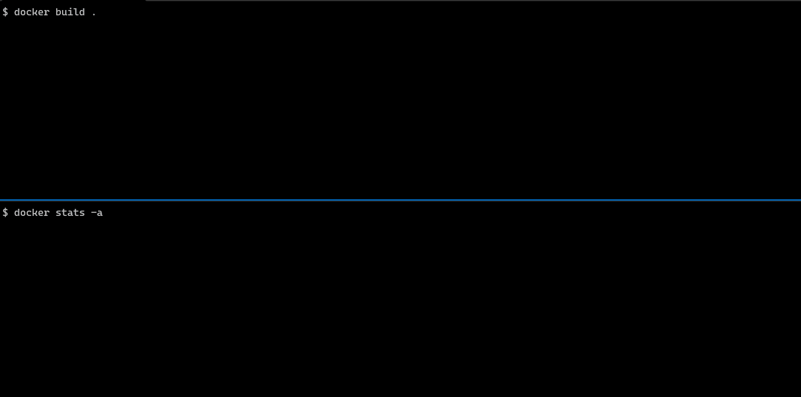
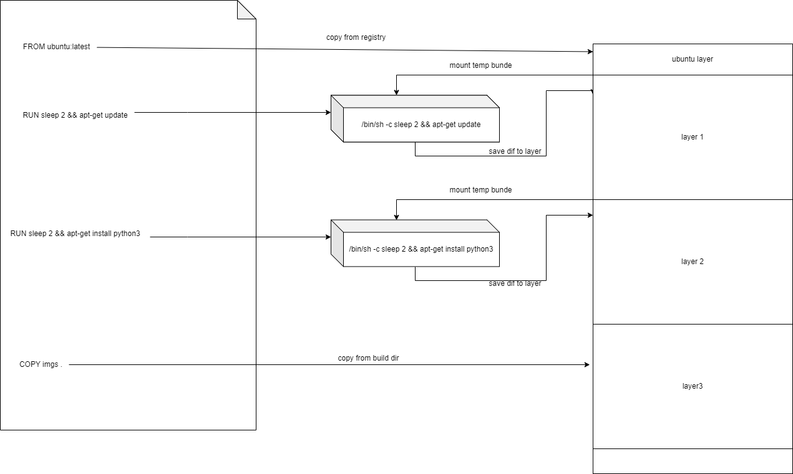
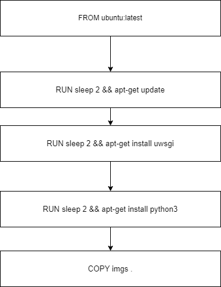
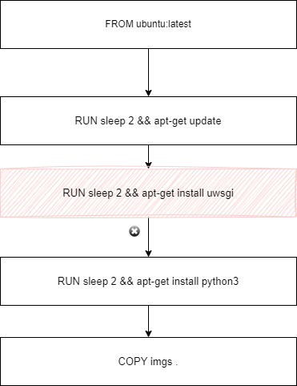
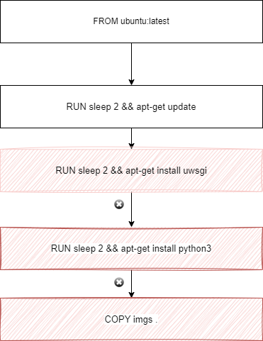

## What is a Docker image?

Simply put, a Docker image is a file used to execute code in a Docker container.  
* Docker images act as a set of instructions to build a Docker container, like a template. Docker images also act as the starting point when using Docker. 
An image is comparable to a snapshot in virtual machine (VM) environments.
* A Docker image also contains application code, libraries, tools, dependencies and other files needed to make an application run.
When a user runs an image, it can become one or many instances of a container.
* Docker images have multiple layers, each one originates from the previous layer but is different from it. The layers speed up Docker builds while increasing reusability and decreasing disk use. Image layers are also read-only files. Once a container is created, a writable layer is added on top of the unchangeable images, allowing a user to make changes.

### Docker container vs. Docker image
A Docker container is a virtualized runtime environment used in application development. It is used to create, run and deploy applications that are isolated from the underlying hardware. A Docker container can use one machine, share its kernel and virtualize the OS to run more isolated processes.
As a result, Docker containers are lightweight.


A Docker image is like a snapshot in other types of VM environments. It is a record of a Docker container at a specific point in time. Docker images are also immutable. While they can't be changed, they can be duplicated, shared or deleted. The feature is useful for testing new software or configurations because whatever happens, the image remains unchanged.

Containers need a runnable image to exist. Containers are dependent on images, because they are used to construct runtime environments and are needed to run an application.

## Docker Container

#### Difference between a kernel, an operating system, and a distribution.
* **Linux kernel** is the core part of the Linux operating system. It's what originally Linus wrote.
* **Linux OS** is a combination of the kernel and a user-land (libraries, GNU utilities, config files, etc).
* **Linux distribution** is a particular version of the Linux operating system like Debian or CentOS.

#### Does a Container have an Operating System inside?

NO, a container is actually just a process running on the **Linux host**.   
The container process is isolated ([namespaces](https://docs.docker.com/engine/security/#kernel-namespaces)) from the rest of the system and restricted from both the resource consumption ([cgroups](https://docs.docker.com/engine/security/#control-groups)) and security ([capabilities](https://man7.org/linux/man-pages/man7/capabilities.7.html), [AppArmor](https://docs.docker.com/engine/security/apparmor/), [Seccomp](https://docs.docker.com/engine/security/seccomp/)) standpoints.   
But in the end, this is still a regular process, same as any other process on the host system.

## How docker container images are created

Let's understand the process by building a simple image using Dockerfile
```text
FROM ubuntu:latest

RUN sleep 2 && apt-get update
RUN sleep 2 && apt-get install -y uwsgi
RUN sleep 2 && apt-get install -y python3

COPY imgs .
```

Before we build this image, lets open a new terminal and run docker stats -a



As we see above docker is launching containers while building the images, one for each RUN command

~

Each RUN instruction, is executed in a temporary container launched from the previous image, instructions are executed in this temporary container, and an image layer is generated and added on top of the exisiting image

#### How does the build cache work?

Each instruction in this Dockerfile translates (roughly) to a layer in your final image. You can think of image layers as a stack, with each layer adding more content on top of the layers that came before it.



Whenever a layer changes, that layer will need to be re-built. For example, suppose you remove the instructions to "install uwsgi".



Docker will invalidate the cache for this layer, as well the subsequent layers



And that’s the Docker build cache in a nutshell. Once a layer changes, then all downstream layers need to be rebuilt as well. Even if they wouldn’t build anything differently, they still need to re-run.

## How to modify a Docker image

Interestingly, we can also "commit" changes to a Docker image. When you commit changes, you essentially create a new image with an additional layer that modifies the base image layer.  
Lets see how

1. Either pull a docker image, or reuse existing image, we first list the images
```text
$ docker images
REPOSITORY   TAG       IMAGE ID       CREATED             SIZE
ubuntu       latest    08d22c0ceb15   6 weeks ago         77.8MB
```

2. Then we launch a container with this image
```text
docker run -it 08d22c0ceb15 bin/bash
```

3. Now we are inside this container and we can modify this container
```text
root@7eff45c7c05a:/# apt update && apt install nmap
....
root@7eff45c7c05a:/# exit

```

4. After exiting we need to list the launched containers
```text
$ docker ps -a
CONTAINER ID   IMAGE          COMMAND      CREATED              STATUS                      PORTS     NAMES
7eff45c7c05a   08d22c0ceb15   "bin/bash"   About a minute ago   Exited (0) 17 seconds ago             romantic_cori
```

5. Finally, we can create a new image from this container
```text
docker commit 7eff45c7c05a ubuntu-with-nmap
```

The newly created image will now be visible in
```text
$ docker images
REPOSITORY         TAG       IMAGE ID       CREATED              SIZE
ubuntu-with-nmap   latest    04feaa0bbcf9   About a minute ago   150MB
ubuntu             latest    08d22c0ceb15   6 weeks ago          77.8MB
```

### Copy files to/from running container
Bonus Tip:
```text
$ docker cp ./some_file $CONTAINER_ID:/work
$ docker cp $CONTAINER_ID:/var/logs/ /tmp/app_logs

```

## How to build image without Dockerfile

Dockerfile is not the only mechanism to build docker files, the other popular mechanism's include
1. [Podman](https://github.com/containers/podman) & [Buildah](https://github.com/containers/buildah)
2. [BuildKit](https://github.com/moby/buildkit)
3. [img](https://github.com/genuinetools/img)
4. [kaniko](https://github.com/GoogleContainerTools/kaniko) by Google
5. [makisu](https://github.com/uber-archive/makisu) by Uber
